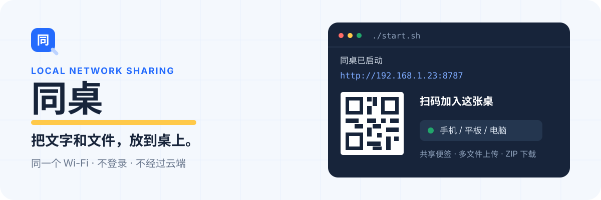

<p align="center">
  
</p>

<p align="center">
  <strong>一条命令启动，一张二维码加入。</strong><br>
  浏览器里的局域网共享桌，不登录，也不经过云端。
</p>

## 它能做什么

同桌适合把网址、验证码、临时说明和文件快速传给身边的设备。电脑运行服务后，同一 Wi‑Fi 下的手机、平板和其他电脑都可以扫码访问。

- **共享文字**：保存一段公共文字，也可以一键复制。
- **多文件上传**：支持文件多选和拖拽，重名文件自动编号，不覆盖原文件。
- **灵活下载**：单独下载文件，或全选后打包为 ZIP。
- **扫码加入**：终端和网页都会显示真实局域网地址对应的二维码。
- **移动端适配**：窄屏布局、触摸选择和自然页面滚动。
- **轻量运行**：服务端只使用 Python 标准库。

## 快速开始

### 环境

- Python 3.10+
- [`qrencode`](https://fukuchi.org/works/qrencode/)（用于终端和网页二维码）
- Linux 或其他可以运行 Shell 脚本的类 Unix 系统

Arch Linux：

```bash
sudo pacman -S qrencode
```

Debian / Ubuntu：

```bash
sudo apt install qrencode
```

### 启动

```bash
git clone <你的仓库地址>
cd lan-share
./start.sh
```

终端会显示可以访问的局域网地址和二维码：

```text
同桌已启动。请让其他设备连接同一个 Wi-Fi，然后打开：
  http://192.168.1.23:8787

手机扫码打开（http://192.168.1.23:8787）：
  [ terminal QR code ]

文件保存位置：/path/to/lan-share/shared_files
按 Ctrl+C 停止。
```

让其他设备连接同一个 Wi‑Fi，扫描二维码或在浏览器输入地址即可。

> 本机即使通过 `http://localhost:8787` 打开，网页二维码仍会使用真实局域网 IP。

## 使用方式

### 共享文字

在共享便签中编辑内容，点击 **保存并同步**。点击 **复制文字** 可以复制文本框中的全部内容。

### 上传与下载文件

点击上传区域选择多个文件，或把文件拖入页面。上传后的文件保存在：

```text
shared_files/
```

点击文件名可以单独下载；勾选文件或点击 **全选**，再点击 **下载所选**，服务端会实时生成 ZIP。

### 更换端口

```bash
python3 server.py --port 9000
```

## 工作方式

```text
一台电脑运行 server.py
        │
        ├── 共享文字 → shared_text.txt
        ├── 上传文件 → shared_files/
        └── 局域网 HTTP :8787
                 │
          同一 Wi-Fi 下的浏览器
```

服务监听 `0.0.0.0`，自动寻找当前联网使用的 IPv4 地址，并为这个地址生成二维码。页面通过简单的 HTTP API 保存文字、上传文件和创建 ZIP。

## 数据与限制

- 共享文字保存在项目根目录的 `shared_text.txt`。
- 上传文件保存在 `shared_files/`。
- 单次上传请求最大为 **512 MB**。
- 相同文件名会保存为 `文件名 (2).扩展名`，不会覆盖已有文件。
- `shared_text.txt` 和 `shared_files/` 中的用户文件已被 Git 忽略。
- 当前没有账号、密码、权限隔离或 HTTPS；请只在可信局域网中使用。
- 关闭服务不会删除已经保存的文字和文件。

## 常见问题

<details>
<summary><strong>其他设备打不开地址</strong></summary>

确认两台设备连接同一个 Wi‑Fi；允许防火墙放行 Python 使用的端口；检查路由器是否开启了“客户端隔离”或“AP 隔离”。

</details>

<details>
<summary><strong>二维码没有出现</strong></summary>

运行 `qrencode --version` 检查是否安装。安装后重新启动服务。

</details>

<details>
<summary><strong>终端显示了多个 172.x.x.x 地址</strong></summary>

Docker、虚拟机或 VPN 可能创建额外网卡。优先使用终端“手机扫码打开”后括号中的地址；它是服务自动判断的主要联网地址。

</details>

## 项目结构

```text
lan-share/
├── server.py              # HTTP 服务、存储、二维码和 ZIP 下载
├── start.sh               # 启动入口
├── web/
│   ├── index.html         # 页面结构
│   ├── app.css            # 响应式界面
│   └── app.js             # 同步、上传与下载交互
├── shared_files/          # 用户上传文件（Git 忽略）
└── assets/readme/         # README 视觉资源
```

## 开发

项目没有第三方 Python 依赖。修改后可以运行：

```bash
python3 -m py_compile server.py
node --check web/app.js
```

然后启动服务，在电脑和手机浏览器中检查页面。

## License

目前仓库尚未添加开源许可证。在添加许可证前，默认保留所有权利。
